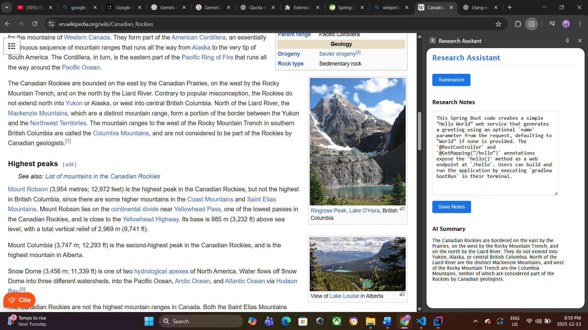
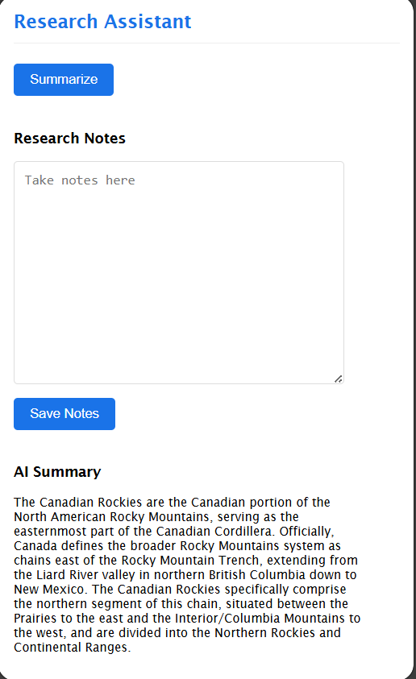
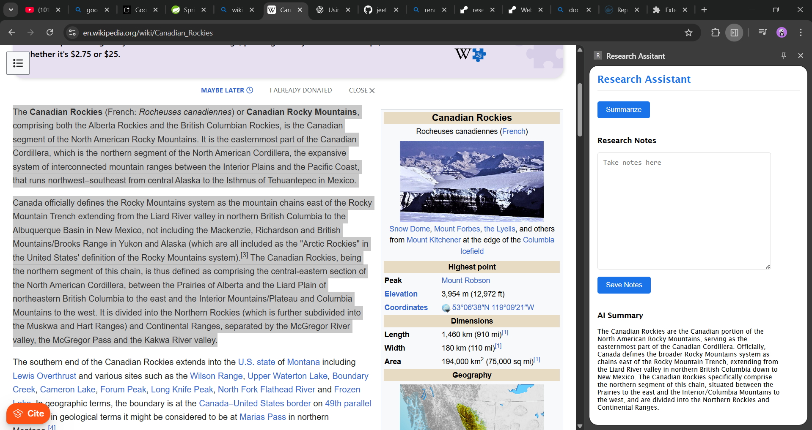
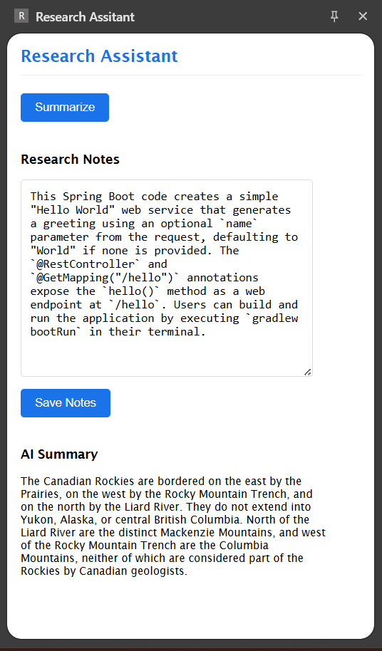

# 🧠 AI Research Assistant (Chrome Extension)

AI Research Assistant is a lightweight Chrome extension designed to **summarize large blocks of text and entire web pages** to help you understand content faster and more effectively. It leverages **Google Gemini Flash 2.5** for fast, high‑quality summaries, making it ideal for research, studying, and productivity.

---

## ✨ Features

* 📄 **Summarize Large Text** – Copy long articles, notes, or research papers and get concise summaries
* 🌐 **Summarize Web Pages** – Quickly understand lengthy web pages without reading everything
* ⚡ **Powered by Gemini Flash 2.5** – Fast and efficient AI model optimized for summarization
* 💾 **Save Research Notes** – Automatically store summaries locally using Chrome Storage
* 🧩 **Minimal & Clean UI** – Distraction‑free interface focused on readability
* 🔒 **Local Storage** – Notes are saved locally on your device

---

## 🛠️ Tech Stack

* **JavaScript (Vanilla JS)**
* **Chrome Extension APIs**
* **Google Gemini Flash 2.5 API**
* **HTML & CSS**
* **Java & Spring Boot**

---

## 📸 Screenshots

**General View**
---

---
**Side-Panel View**
---

---
**Demo of Copying and Summarizing**
---

---
**Copying and Saving Notes**
---



$1

---

## 🚀 Installation

1. Clone the repository:

   ```bash
   git clone https://github.com/jeet7122/AI-RESEARCH-ASSISTANT-UI.git
   ```
2. Open **Chrome** and navigate to:

   ```
   chrome://extensions
   ```
3. Enable **Developer Mode** (top right)
4. Click **Load unpacked**
5. Select the project folder

---

## 🔑 Configuration (Gemini API Key)

1. Get your Gemini API key from **Google AI Studio**
2. Add your API key in the appropriate JS file:

```js
const GEMINI_API_KEY = "YOUR_API_KEY_HERE";
```

⚠️ **Do not expose your API key in public repositories**. Use environment variables or a secure setup for production.

---

## 🧪 Usage

1. Open the extension from the Chrome toolbar
2. Paste text **or** summarize the current web page
3. Click **Summarize**
4. Review and save your summarized notes

---

## 🎯 Use Cases

* Academic research
* Reading long blog posts or documentation
* Exam preparation
* Technical article summarization
* Faster content comprehension

---

## 🧩 Project Structure

```bash
AI-RESEARCH-ASSISTANT-UI/
│── manifest.json
│── sidePanel.html
│── sidePanel.js
│── sidePanel.css
│── background.js
│── assets/
```

---

## 🔮 Future Improvements

* 🔍 Keyword-based summaries
* 📑 Export summaries (PDF / Markdown)
* 🌙 Dark mode
* 🧠 Multi-language support
* ☁️ Cloud sync for notes

---

## 🤝 Contributing

Contributions are welcome! Feel free to fork the repo, open issues, or submit pull requests.

---

## 📜 License

This project is licensed under the **MIT License**.

---

## 👤 Author

**Jeet**
GitHub: [@jeet7122](https://github.com/jeet7122)

---

⭐ If you find this project helpful, don’t forget to star the repository!
